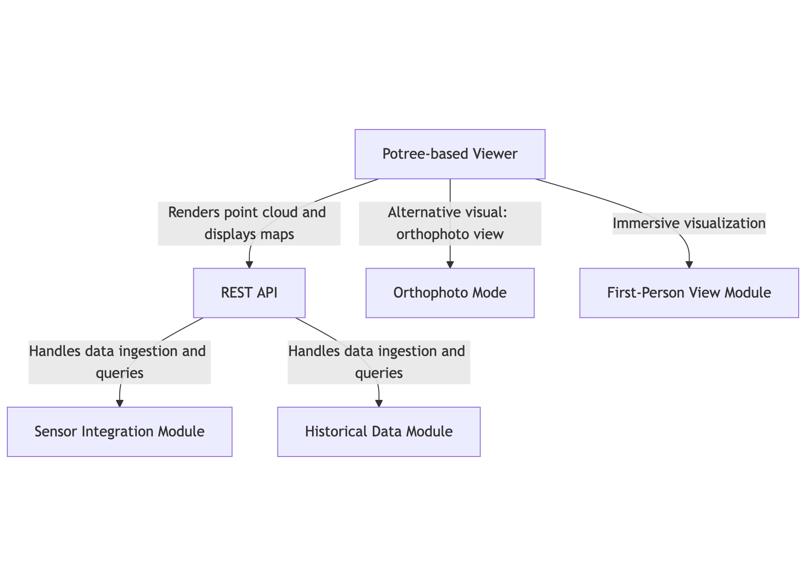

# 🌾 Digital Twin in Precision Agriculture  
**A Web-Based System for 3D Point Cloud Multi-Vegetative Index Visualization and Real-Time Sensor Data**

[**📄 Read the Paper**](https://doi.org/10.1016/j.softx.2025.102443) | [**🌐 View Demo**](https://berca.uv.es/viewer/demo/elpuig.html)

## 📌 About the Project

This repository contains the source code for the system presented in our paper:  
[**"Digital Twin in Precision Agriculture: A Web-Based System for 3D Point Cloud Multi-Vegetative Index Visualization and Real-Time Sensor Data"**](https://doi.org/10.1016/j.softx.2025.102443)  
(Universitat de València, 2025)

The system introduces a comprehensive web platform to monitor agricultural fields using a geolocated digital twin, 3D point cloud visualization, and real-time sensor data integration.

## 🧠 Key Features

- **3D Point Cloud Viewer** based on [Potree](https://potree.org), aligned with OpenStreetMap for geographical context
- **Multi-Vegetative Index Visualization** (NDVI, CIV, etc.) with lazy-load toggling
- **Real-Time Sensor Integration** via REST API supporting XML, JSON, and CSV formats
- **Historical Sensor Analytics** with interactive Chart.js visualizations
- **Immersive First-Person View** developed in Three.js for field exploration
- **Efficient Data Handling** using Redis (for caching) and MongoDB (for storage)

## 🏗️ System Architecture



The platform is composed of:
- A RESTful API (Node.js + Express)
- Potree-based 3D viewer
- Three.js-based first-person explorer
- MongoDB and Redis backend

## 🚀 Getting Started

### Prerequisites

- Node.js >= 16
- Docker
- [git-lfs](https://git-lfs.com)

### Clone the Repository

```bash
git clone https://github.com/2Candis-Agriculture6-0/PointCloudViewer.git
cd PointCloudViewer
git lfs pull
```

### Install Dependencies

```bash
npm install
```

### Build and Deploy (Docker)

```bash
docker compose up
```

### Demo

Demo is available on ```localhost:3000/viewer/demo/elpuig.html```

## 📊 Sensor API Endpoints

- `GET /sensors` - Retrieve all sensors
- `GET /sensors/:id` - Sensor metadata
- `GET /real/sensors/:id` - Real-time data (via Redis cache)
- `POST /sensors` - Ingest data (XML, JSON, CSV supported)

## 🖥️ Visualizations

- Toggle between orthophoto, point cloud, and first-person views
- View NDVI/CIV with real-time and historical sensor overlays
- Interact with clickable sensor points
- Explore historical graphs via Chart.js

## 📚 Citation

If you use this codebase or system in your research, please cite our paper (not yet accepted):

```
@article{SalcedoNavarro2023DigitalTwin,
  title={A scalable web system for multi-index 3D point cloud visualization and real-time sensor monitoring in precision agriculture},
  author={Salcedo-Navarro, Andoni and Montalban-Faet, Guillem and Segura-Garcia, Jaume and Garcia-Pineda, Miguel},
  journal={SoftwareX},
  doi={10.1016/j.softx.2025.102443},
  year={2025},
  volume={32},
}
```

## 👥 Authors

- [Andoni Salcedo-Navarro](https://github.com/AndoniSalcedo)
- Guillem Montalban-Faet
- [Jaume Segura-Garcia](https://github.com/jausegar)
- [Miguel Garcia-Pineda](https://github.com/migarpi)

## 🧑‍🔬 Contact

For inquiries or collaboration opportunities:  
📧 jaume.segura@uv.es  
📧 miguel.garcia-pineda@uv.es
